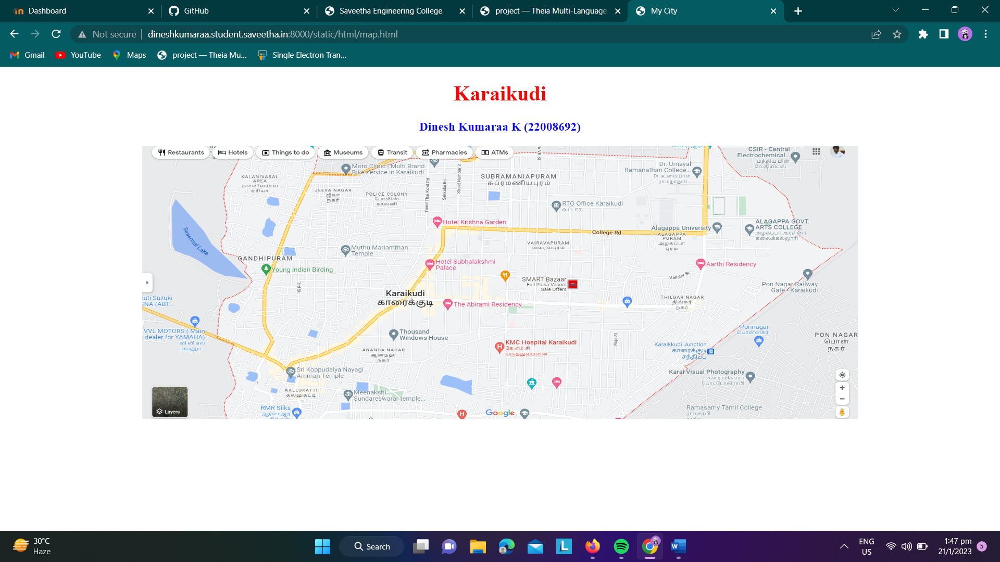
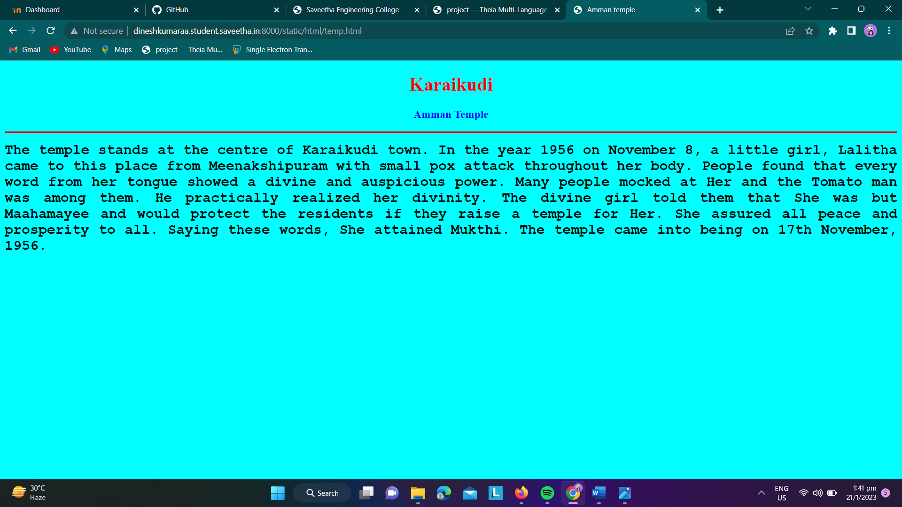
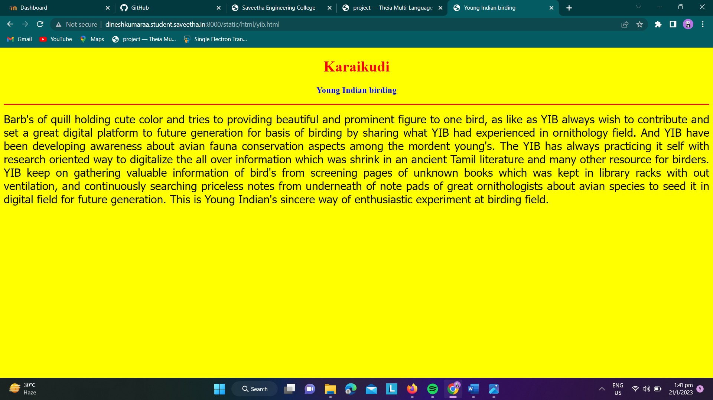
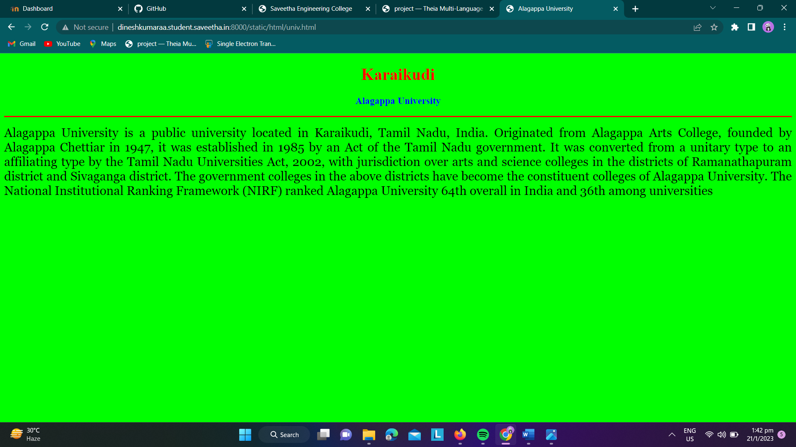
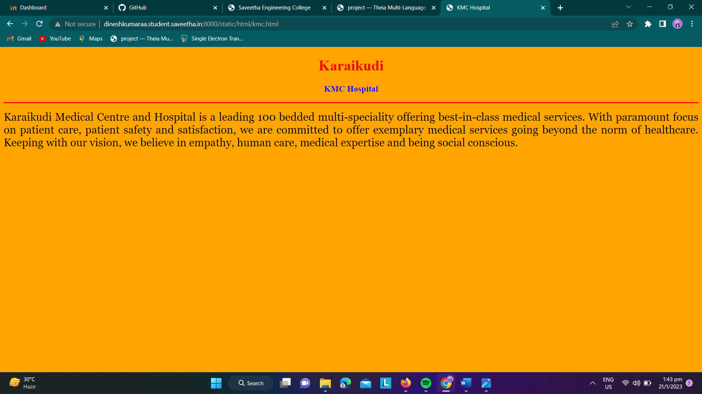
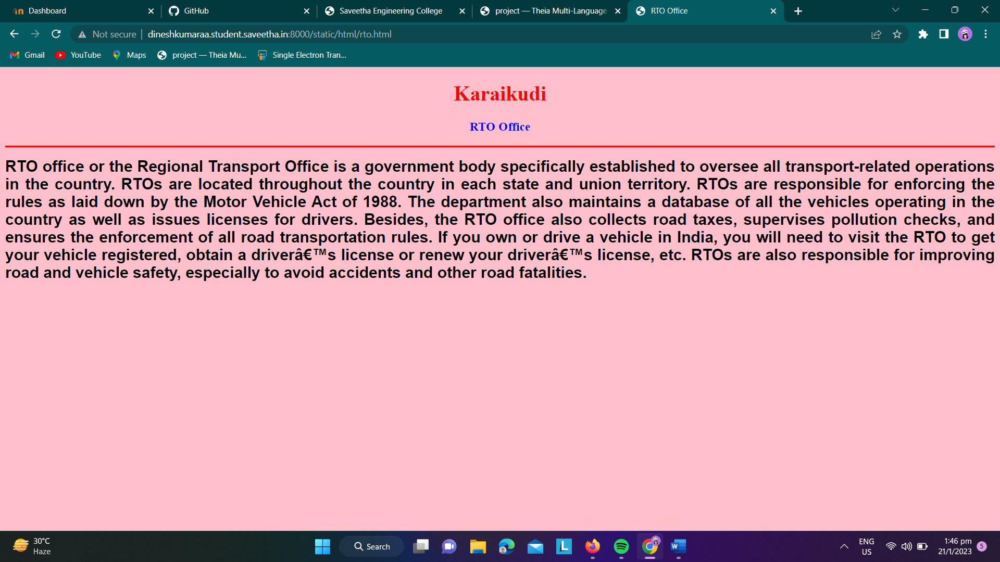
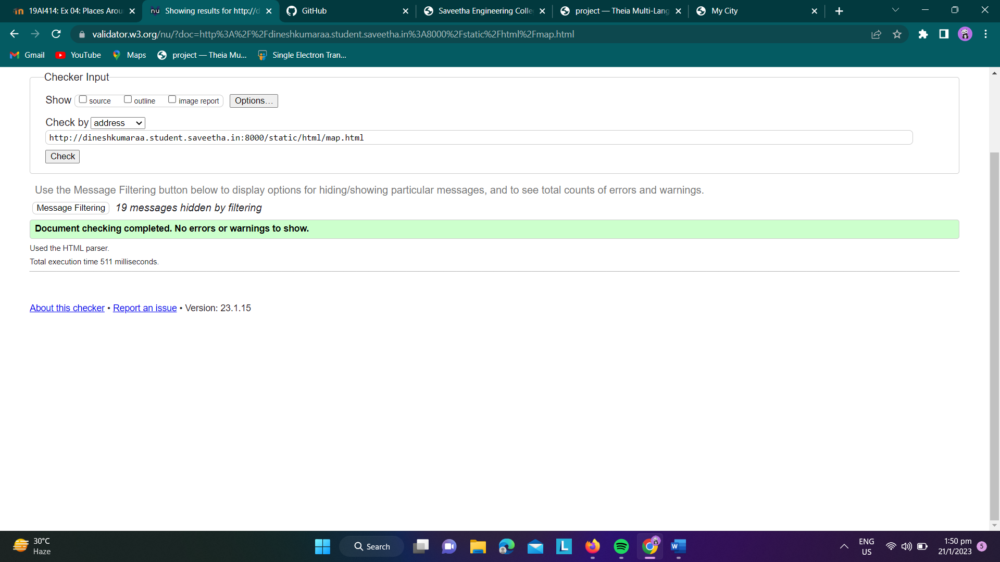

# Places Around Me
## AIM:
To develop a website to display details about the places around my house.

## Design Steps:

### Step 1:
clone the github repository into Theia IDE.

### Step 2:
Create a new Django project

### step 3:
Write the needed HTML code.

### step 4:
Run the Django server and execute the HTML files

## Code:
```
map.html

<!DOCTYPE html>
<html lang="en">
<head>
<title>My City</title>
</head>
<body>
<h1 align="center">
<font color="red"><b>Karaikudi</b></font>
</h1>
<h3 align="center">
<font color="blue"><b>Dinesh Kumaraa K (22008692)</b></font>
</h3>
<center>

<map name="MyCity">
<area shape="circle" coords="190,50,20" href="/static/html/univ.html" title="Alagappa University">
<area shape="rectangle" coords="230,30,260,60" href="/static/html/rto.html" title="RTO Office">
<area shape="circle" coords="400,350,50" href="/static/html/kmc.html" title="KMC Hospital">
<area shape="circle" coords="400,200,75" href="/static/html/temp.html" title="Amman temple">
<area shape="rectangle" coords="490,150,870,320" href="/static/html/yib.html" title=”Young Indian Birding">
</map>
</center>
</body>
</html>

univ.html

<!DOCTYPE html>
<html lang="en">
<head>
<title>Alagappa University</title>
</head>
<body bgcolor="lime">
<h1 align="center">
<font color="red"><b>Karaikudi</b></font>
</h1>
<h3 align="center">
<font color="blue"><b>Alagappa University</b></font>
</h3>
<hr size="3" color="red">
<p align="justify">
<font face="Georgia" size="5">
Alagappa University is a public university located in Karaikudi, Tamil Nadu, India. Originated from Alagappa Arts College, founded by Alagappa Chettiar in 1947, it was established in 1985 by an Act of the Tamil Nadu government. It was converted from a unitary type to an affiliating type by the Tamil Nadu Universities Act, 2002, with jurisdiction over arts and science colleges in the districts of Ramanathapuram district and Sivaganga district. The government colleges in the above districts have become the constituent colleges of Alagappa University.
The National Institutional Ranking Framework (NIRF) ranked Alagappa University 64th overall in India and 36th among universities
</font>
</p>
</body>
</html>

rto.html

<!DOCTYPE html>
<html lang="en">
<head>
<title>RTO Office</title>
</head>
<body bgcolor="pink">
<h1 align="center">
<font color="red"><b>Karaikudi</b></font>
</h1>
<h3 align="center">
<font color="blue"><b>RTO Office</b></font>
</h3>
<hr size="3" color="red">
<p align="justify">
<font face="Arial" size="5">
<b>
RTO office or the Regional Transport Office is a government body specifically established to oversee all transport-related operations in the country. RTOs are located throughout the country in each state and union territory. RTOs are responsible for enforcing the rules as laid down by the Motor Vehicle Act of 1988.
The department also maintains a database of all the vehicles operating in the country as well as issues licenses for drivers. Besides, the RTO office also collects road taxes, supervises pollution checks, and ensures the enforcement of all road transportation rules. If you own or drive a vehicle in India, you will need to visit the RTO to get your vehicle registered, obtain a driver’s license or renew your driver’s license, etc.
RTOs are also responsible for improving road and vehicle safety, especially to avoid accidents and other road fatalities.
</b>
</font>
</p>
</body>
</html>

kmc.html

<!DOCTYPE html>
<html lang="en">
<head>
<title>KMC Hospital</title>
</head>
<body bgcolor="orange">
<h1 align="center">
<font color="red"><b>Karaikudi</b></font>
</h1>
<h3 align="center">
<font color="blue"><b>KMC Hospital</b></font>
</h3>
<hr size="3" color="red">
<p align="justify">
<font face="Georgia" size="5">
Karaikudi Medical Centre and Hospital is a leading 100 bedded multi-speciality offering best-in-class medical services. With paramount focus on patient care, patient safety and satisfaction, we are committed to offer exemplary medical services going beyond the norm of healthcare. Keeping with our vision, we believe in empathy, human care, medical expertise and being social conscious.
</font>
</p>
</body>
</html>

temp.html

<!DOCTYPE html>
<html lang="en">
<head>
<title>Amman temple</title>
</head>
<body bgcolor="cyan">
<h1 align="center">
<font color="red"><b>Karaikudi</b></font>
</h1>
<h3 align="center">
<font color="blue"><b>Amman Temple</b></font>
</h3>
<hr size="3" color="red">
<p align="justify">
<font face="Courier New" size="5">
<b>
The temple stands at the centre of Karaikudi town.  In the year 1956 on November 8, a little girl, Lalitha came to this place from Meenakshipuram with small pox attack throughout her body.  People found that every word from her tongue showed a divine and auspicious power.  Many people mocked at Her and the Tomato man was among them.  He practically realized her divinity.  The divine girl told them that She was but Maahamayee and would protect the residents if they raise a temple for Her.  She assured all peace and prosperity to all.  Saying these words, She attained Mukthi.  The temple came into being on 17th November, 1956.
</b>
</font>
</p>
</body>
</html>

yib.html

<!DOCTYPE html>
<html lang="en">
<head>
<title>Young Indian birding</title>
</head>
<body bgcolor="yellow">
<h1 align="center">
<font color="red"><b>Karaikudi</b></font>
</h1>
<h3 align="center">
<font color="blue"><b> Young Indian birding </b></font>
</h3>
<hr size="3" color="red">
<p align="justify">
<font face="Tahoma" size="5">
Barb's of quill holding cute color and tries to providing beautiful and prominent figure to one bird, as like as YIB always wish to contribute and set a great digital platform to future generation for basis of birding by sharing what YIB had experienced in ornithology field. And YIB have been developing awareness about avian fauna conservation aspects among the mordent young's. The YIB has always practicing it self with research oriented way to digitalize the all over information which was shrink in an ancient Tamil literature and many other resource for birders.

YIB keep on gathering valuable information of bird's from screening pages of unknown books which was kept in library racks with out ventilation, and continuously searching priceless notes from underneath of note pads of great ornithologists about avian species to seed it in digital field for future generation. This is Young Indian's sincere way of enthusiastic experiment at birding field.
</font>
</p>
</body>
</html>
```


## Output:












## HTML Validator



## Result:
The program for implementing image map is executed successfully.